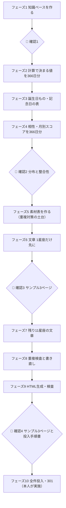

# 🛠 作業指示書 — 2027年版 誕生日占い 366ページ（リポジトリ版）

> [!important] このファイルだけ読めば進められるように書いてある
> 上から順に進めること。**🛑 マークの場所では必ず止まって本人（翔太）に確認する。**
> 迷ったときの優先順位：**① 占いとして正しい ＞ ② 日ごとに内容が違う ＞ ③ 文章がきれい ＞ ④ 作業が早い**

## 0. 前提

### 0-1. リポジトリの中身
| パス | 中身 |
|---|---|
| `CLAUDE.md` | 毎回読む短いルール（始め方・再開のしかた） |
| `docs/01_作業指示書.md` | **このファイル。作業の流れの正本** |
| `docs/02_実装仕様.md` | 何を作るか（ページ構成・必須項目・収益・リンク先・計算ロジック） |
| `docs/03_経緯と判断の記録.md` | ここまでの検討の経緯（読み物。迷ったときに参照） |
| `docs/prototype/birthday-0101-2027_試作.html` | **見た目・部品・分量の見本**（中の文章と数値は仮） |
| `docs/reference/サイト共通ルール_引き継ぎ・作業ルール.md` | サイト全体のルール（CSSは `fh-` 接頭辞、本人確認の範囲など） |
| `docs/reference/有名人欄_作成ルール.md` | 有名人欄のルール |
| `source/famous/01月.md`〜`12月.md` | 検証済みの有名人データ（流用してよい） |
| `work/` | **作業の成果物はすべてここ**（下の0-3） |

### 0-2. 基本方針
- **一から作る。** 現行ページ（`https://www.uranai.epoch-compass.com/2026-MMDD/`）は「項目の抜けがないかの確認」にだけ使う。**現行の文章・数値・相性・ラッキー情報は流用しない。**
  - 例外：**有名人**は `source/famous/` の検証済みデータを使う（`docs/reference/有名人欄_作成ルール.md` に従う）
- **占いの値は計算で出す。記憶や推測で書かない。** 計算できないもの（花言葉・誕生石など）は出典を1つ決めて、出典名を記録する
- **366日を1ページずつ作らない。** 全日付分を「表（データ）」として作り、検査してから、最後にHTMLへ流し込む
- **サイト（WordPress）には触らない。** このリポジトリでは、投入用のファイルと手順書を作るところまで

### 0-3. 作業フォルダ（`work/`）
```
work/
├─ 00_進捗.md     ← 作業のたびに更新（0-4）。新しいセッションはここから再開する
├─ knowledge/     ← フェーズ1：占いの知識ベース（出典つき）
├─ scripts/       ← 計算・検査・生成のスクリプト（Python）
├─ data/          ← 366日分の表（JSON/CSV）
├─ text/          ← 文章（星座ごと）
├─ reports/       ← 検査結果（重複・分布・整合性）
└─ out/           ← 生成したHTML・WP All Import用CSV・301一覧・投入手順書
```

### 0-4. 進捗と保存
- `work/00_進捗.md` に、フェーズごとに `⬜/🔵/✅/🔴` と文字バー（`███░░░░░░░ 30%`）、**次にやること**、**🛑で本人に聞いていること**を書く
- **フェーズ（または星座）が1つ終わるたびにコミットして push する。** 1回のセッションで全部終わらなくてよい。途中で止まっても、次のセッションが `work/00_進捗.md` を読めば続きから進められる状態を常に保つ
- 報告は日本語・専門用語を避けて。ファイルはリポジトリ内のパスで示す

### 0-5. 作業環境
- クラウド環境はネットワーク制限で外部サイトに届かないことがある
  - **天文計算は `pyswisseph`（pipで入る。暦データの追加ダウンロード不要）を優先**。必要なら `skyfield` も可だが、暦ファイルが取れなければ止まって本人に相談
  - 出典の確認（Web検索・ページ取得）ができない場合は、その項目を「未確認」として表に残し、🛑で本人に相談
- 長い作業は、星座ごと・フェーズごとに区切ってよい（サブエージェントで並行してもよいが、検査は必ず全体で通す）

---

## 全体の流れ



---

## フェーズ1 知識ベースを作る（正しい占いのため）

**目的：** 占術ごとに「定義・計算方法・意味（解釈）」を出典つきでまとめ、以後の計算と文章はここだけを根拠にする。

`work/knowledge/` に占術ごとに1ファイル。各ファイルに必ず入れる：①定義 ②計算方法（式・境界の扱い）③解釈の表 ④出典（URL・書名）⑤不確かな点

| ファイル | 中身 | 計算・確認の方法 |
|---|---|---|
| `01_西洋占星術.md` | 12星座の性質・支配星・エレメント・区分、36デーカンの支配星と意味、アスペクト（0/60/90/120/180度）の意味 | 天体位置は**天文計算ライブラリ（例：Python の skyfield＋JPL暦、または pyswisseph）で計算**。記憶で書かない |
| `02_2027年の天体.md` | 2027年の太陽・水星・金星・火星・木星・土星の星座移動日、日食・月食、水星逆行 | ライブラリで計算し、**日食・月食は NASA の日食カタログ等、節気は国立天文台の暦要項と照合** |
| `03_二十四節気・七十二候.md` | 名称・読み・意味、2027年の日付 | 太陽黄経15度ごと（節気）・5度ごと（候）で計算し、国立天文台の値と照合 |
| `04_九星気学.md` | 九星の性質・五行、本命星の出し方（立春で切替）、年盤・月盤の飛泊、相生相剋 | 2027年の年盤（九紫中宮）・月盤を計算して表にする |
| `05_干支・五行・四柱推命.md` | 十干・十二支・六十干支の意味、五行の相生相剋、年柱・月柱（節入り）・日柱の出し方、日干10タイプの解釈 | 日柱は既知の日付で検算（複数の万年暦サイトと照合） |
| `06_宿曜.md` | 27宿の性質、本命宿の出し方（**旧暦の月日＋宿曜経の表**）、宿どうしの相性（命・業胎・栄親・友衰・安壊・危成） | 旧暦は朔（新月）と中気から計算して作る。既知の旧暦日と照合 |
| `07_マヤ暦.md` | 20の太陽の紋章・13の銀河の音、KINの出し方（ドリームスペル方式、2/29を数えない） | 既知の日付のKINで検算 |
| `08_数秘術.md` | 1〜9・11・22・33の意味、ライフパス・誕生日の数・パーソナルイヤー/マンス/デイ | — |
| `09_バイオリズム.md` | 23・28・33日周期、好調日・注意日の判定 | — |
| `10_誕生日もの.md` | 誕生花・花言葉、誕生石、誕生日石、誕生色の**採用する出典**（1つずつ）と、採用理由 | 出典が複数ある場合は「採用する1つ」を決めて表に記録 |
| `11_動物×色占い.md` | 既存ページ `/animal-color/` の計算方法と60タイプ | 既存ページのJSを読んで、そのまま再現できるように書く |

**フェーズ1の完了条件：** 上の11ファイルがそろい、各ファイルに出典がある。計算系はスクリプト `work/scripts/calc_*.py` で再現でき、既知の値との照合結果が `work/reports/knowledge_check.md` にある。

### 🛑 確認1
本人に `work/reports/knowledge_check.md` と、照合で合わなかった項目・決めきれなかった出典を報告して止まる。

---

## フェーズ2 計算で決まる値を366日分（`work/data/base_366.json`）

キーは `MMDD`（0101〜1231、0229を含む）。スクリプト `work/scripts/build_base.py` で一括作成。**手で書かない。**

各日付に入れる値：
- 星座・**太陽の度数（その日のおおよその黄経）**・デーカン（支配星）・エレメント・区分・星座の境目フラグ（年によって星座が変わる日）
- 二十四節気・七十二候（その日に当たるもの）
- 誕生日の数、2027年のパーソナルイヤー、12か月のパーソナルマンス
- 2027年の誕生日当日：曜日・日の干支・パーソナルデー
- 前後の日（リンク用）

---

## フェーズ3 誕生日もの・記念日（`work/data/birthday_items_366.csv`）

列：`MMDD, 項目, 値, 補足（花言葉など）, 出典, 確認済み`

- 誕生花・誕生石（月）・誕生日石・誕生色：フェーズ1で決めた出典で366日を埋める
- **記念日・できごと：1日2〜3件。日本人目線の「良いこと」だけ**
  - 入れない：事故・災害・事件・戦争・テロ・訃報・政治的に意見が割れるもの
  - 小さな話題でよい（〇〇の日、初めて〇〇が発売・開業した日 など）
  - 1件ずつ出典URLを記録。見つからない日は「その季節の行事・旬のもの」で代える
  - 0229 は無しでよい

---

## フェーズ4 相性・月別スコアを366日分

### 4-1. 相性（`work/data/compat_366.json`）
- 「相性の良い5日」「ぶつかりやすい3日」を**全日付まとめて**決める
- 根拠は知識ベースのルールだけを使う（例：星座のエレメント・アスペクト＋誕生日の数の関係＋宿曜の相性を使うなら、そのルールを `knowledge` に明記）
- 1組ごとの一言説明（その組み合わせの根拠に沿ったもの）
- **検査（`work/scripts/check_compat.py` → `work/reports/compat_check.md`）**
  - [ ] 対称性：AがBを「良い」に入れたら、BもAを「良い」に入れる（できない組は理由を記録）
  - [ ] 同じ組が「良い」と「ぶつかる」の両方に入っていない
  - [ ] 1つの日付が他ページに登場する回数の上限（例：最大15回）を守る＝偏らない
  - [ ] 自分自身・前後1日は選ばない
  - [ ] 一言説明の同一文は最大3ページまで

### 4-2. 月別スコア（`work/data/scores_366.json`）
- 3本（＋総合）を0〜100で出す。**スコアは計算で出し、手で整えない**（整えたいときは計算ルール側を直す）
  - **星座**：2027年の各月に、太陽・金星・火星・木星・土星が、その日生まれの**太陽の度数**に作るアスペクトから計算（度数で見るので、隣の日でも少しずつ違う結果になる）
  - **数秘**：パーソナルマンス
  - **暦の五行**：その月の干支（月柱）と、本人の星座のエレメントを五行に対応させた関係
  - 総合：平均。◎○△の境目は分布を見て決める（例：上位25%が◎、下位25%が△）
- **検査（`work/scripts/check_scores.py` → `work/reports/score_check.md`。グラフ画像も出す）**
  - [ ] 366ページの総合の平均・ばらつきの一覧と、星座別の平均
  - [ ] 1ページの中に◎が2つ以上、△が1つ以上ある
  - [ ] 全部良い・全部悪いページがない
  - [ ] 隣り合う日の12か月の推移が完全に同じページがない
  - [ ] 低い月が40を下回るのは、計算上そうなるときだけ（無理に作らない）

### 🛑 確認2
本人に `work/reports/compat_check.md` と `work/reports/score_check.md`（分布のグラフ付き）を見せて止まる。

---

## フェーズ5 素材表を作る（重複対策の土台）

**課題：** 現行の誕生日ページは、同じ星座の約30ページが似た文章になり、Googleに「クロール済み・インデックス未登録」と判断されている可能性がある。**別の日で同じようなことを書かない**ことが最重要。

### 5-1. 素材表（`work/data/materials_366.json`）
各日付に「その日だけの材料」を集めた表を作る。文章はこの表から書く。

| 材料 | どの日と違うか |
|---|---|
| 七十二候（約5日ごと） | 同じ星座の中で6種類ある |
| デーカン（約10日ごと） | 同じ星座の中で3種類 |
| 太陽の度数 | 1日ずつ違う |
| 誕生日の数 | 隣の日で必ず違う |
| 誕生花・花言葉 | 1日ずつ違う |
| 誕生日石・誕生色 | 1日ずつ違う |
| 記念日・できごと | 1日ずつ違う |
| 相性の日付 | 1日ずつ違う |
| 月別スコアの山・谷の月 | 日によって違う |
| 2027年の誕生日当日（曜日・日の干支） | 1日ずつ違う |
| 有名人 | 1日ずつ違う |

### 5-2. セクションごとの「必ず使う材料」
| セクション | 必ず使う材料（最低2つ） |
|---|---|
| 性格 | 星座＋デーカン＋誕生日の数＋七十二候のイメージ＋花言葉 |
| 魂のメッセージ | 花言葉 or 七十二候＋誕生日の数 |
| その年の運命 | パーソナルイヤー＋その日の太陽の度数への主なアスペクト＋山の月 |
| 分野別 | 月別スコアの各分野の山・谷の月（**月の名前はページごとに違う**） |
| 成長と衰え | スコアの谷の月＋誕生日の数 |
| 季節・12か月 | その日のスコア推移（一言は月の数ごとの意味＋星の動き） |
| 開運アクション | 山の月・谷の月・誕生花・誕生石・記念日のどれか |
| お守りリスト | デーカンの支配星の色・誕生石・パーソナルイヤー |
| 誕生日当日 | 曜日・日の干支・パーソナルデー |
| あなたへ | 七十二候 or 記念日 or 花言葉 |

### 5-3. 文章の書き方ルール
- 星座全体に当てはまる一般論は**1セクション1文まで**。残りはその日の材料で書く
- 毎年変わる部分（運命・分野別・成長と衰え・干支九星・季節・12か月・開運アクション・お守り・翌年に向けて・あなたへ）と、変わらない部分（性格・魂・暦と星・誕生日もの・相性・有名人）は**別の列に保存**（来年は前者だけ書き換える）
- 文体：です・ます。「！」は1ページ3回まで。強調は太字とマーカー（`fh-b27-mk`）を各セクション1〜2か所
- 分量：本文は現行（約7,500字）より減らさない。分野別は1項目200〜250字
- 占いの断定はしない（「〜しやすい」「〜の暗示」）。健康・お金で不安をあおらない

---

## フェーズ6 文章（まず1星座だけ）

- 山羊座（12/22〜1/19）だけを先に全部書く（`work/text/capricorn.json`）
- フェーズ8の重複検査を山羊座の中だけで走らせ、基準を満たすまで書き直す
- 山羊座から3ページ（例：1/1・1/10・1/19）をHTMLにして `work/out/sample/` に置く

### 🛑 確認3
本人にサンプル3ページと、山羊座内の重複検査結果を見せて止まる。文体・分量・内容の方向が決まるまで次へ進まない。

---

## フェーズ7 残り11星座の文章

- 確認3で決まった書き方で、星座ごとに書く（`work/text/<星座>.json`）
- 1星座書き終わるたびに、フェーズ8の検査をその星座内＋全体で走らせる

---

## フェーズ8 重複検査と書き直し（`work/scripts/check_dup.py`）

**検査の対象は本文だけ**（見出し・ボタン・注記など全ページ共通の部品は除く）。

| 検査 | 基準 |
|---|---|
| 同じ文 | 同一の文が**4ページ以上**に出たら書き直し（3ページまでは許容） |
| ページ同士の似ている度合い | 文字5-gramのJaccard類似度：**全ページの組で0.25未満**、同じ星座の中で0.30未満 |
| セクション単位 | 同じセクション同士で類似度0.40以上の組は書き直し |
| 材料の使用 | 5-2の「必ず使う材料」が各セクションに入っているか |
| 月の名前 | 本文の「山の月」「慎重な月」が、その日のスコアと一致しているか |

- 結果は `work/reports/dup_check.md`（引っかかった上位50組と、該当文）
- 全部基準を満たすまで書き直す。どうしても満たせない場合は理由を記録して🛑で本人に相談

---

## フェーズ9 HTML生成・検査

- 試作（第4版）と同じ部品・順番・見た目で、`work/out/html/MMDD.html` を366本生成
- 共通CSS・共通JSは各1ファイル（`work/out/assets/`）。ページ側は月日とデータだけを持つ
- 仕様書の「現行ページから必ず引き継ぐもの」「収益」「サイト内の行き来」のチェックリストを、**全366ページに対して機械で確認**（`work/reports/page_check.md`）
- アフィリエイトのリンクは `data-aff` の仮置きのまま（実リンクは本人が用意した表で差し替える。用意がなければ🛑で相談）
- WP All Import 用CSV（タイトル・スラッグ・親ページ `birthday`・本文・メタディスクリプション）と、301の対応表（`/2026-MMDD/`・`/2025-MMDD/` → `/birthday/MMDD/`、連鎖させない）を `work/out/` に出す

### 🛑 確認4（ここでこのリポジトリの作業は完了）
- `work/out/sample/` に 1/1・2/29・星座の境目の日（例：1/20）の3ページを置き、本人に見てもらう（スマホ表示・グラフ・カード保存・目次の二重・シェアボタン）
- `work/out/投入手順書.md` を作る：WP All Import の設定値、テスト投入（3ページ）→ 全件投入の順番、301の設定方法と確認方法、元に戻す方法
- `work/00_進捗.md` を「完了」にしてコミット・push し、本人に完了報告

## フェーズ10 全件投入・301（本人またはローカルセッションで行う）
- このリポジトリからは行わない。`work/out/投入手順書.md` に従って、本人の許可のもとで実施する

---

## やってはいけないこと
- 記憶や推測で、天体の日付・節気・干支・旧暦・宿を書く（必ず計算か出典）
- 現行ページの文章・相性・ラッキー情報をコピーする（有名人以外）
- 1ページずつ思いつきで書く（必ず表→検査→流し込み）
- サイト（WordPress）を変更する（このリポジトリの作業範囲外）
- 六星占術を使う／「動物占い」という名前を使う
