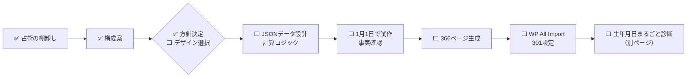

# 🎂 2027年版 誕生日占い — 占術の棚卸しと改善提案（2026-10-10）

> [!note] このノートの位置づけ
> 2027年版366ページの作り直しにあたり、**メイン＋サブ4サイトで使っている占術を全部洗い出し**、誕生日ページに入れる／入れないを仕分けた。デザインモック5案は claude.ai プロジェクト「占いサイト」の `2027_birthday_fortune_handover.md` と同じ会話の添付（`2027_mockup_1〜5_*.html`）。
> 根拠：`/2026-0101/` `/366uranai/` `/animal-color/` `/number-fortune/` を2026-10-10に取得／サブ3サイトは `D:\Obsidian\Obsidian\30_Areas\副業\10_Webメディア\12_占いサイト\記事\サブサイト作成\src\` の全ページのタイトルを機械的に列挙。

## 📍 現在地

```
企画      ██████████ 100% 棚卸し ✅ ／ 方針 ✅ ／ デザイン ✅（J 夜の手帳）
試作      █████░░░░░ 50%  1月1日の試作 ✅ ／ 本人確認 ⬜
技術設計  ░░░░░░░░░░  0%
生成      ░░░░░░░░░░  0%
公開      ░░░░░░░░░░  0%
```



---

## 1. 占術の使用状況（2026-10-10 時点）

「何で決まるか」がいちばん大事。**誕生日ページは月日（366通り）で作るので、生まれ年が要る占術はページの本文には書けない。**

| 占術 | 何で決まるか | メイン | サブ4サイト | 2027年版での扱い |
|---|---|---|---|---|
| 西洋占星術（12星座） | 月日 | ✅ 366日・`/star/`・星座相性 | 縁結び：干支と星座の相性の解説 | ✅ 継続（主役） |
| デーカン（星座を10日ずつ3分割） | 月日 | ❌ | ❌ | 🆕 追加（同じ星座でも日ごとに差が出る） |
| 誕生石・守護石 | 月 | ✅ 366日 | ❌ | ✅ 継続 |
| 誕生花・花言葉 | 月日 | △ `/flower/` は現ナビに無い（要確認） | ❌ | 🆕 強化（1日1花） |
| 二十四節気・七十二候 | 月日 | ❌ | 開運ライフ：二十四節気の暮らし解説 | 🆕 追加（約5日ごとに変わる＝日ごとの個性） |
| 数秘：バースデーナンバー | 日 | ❌ | ❌ | 🆕 追加 |
| 数秘：2027年のパーソナルイヤー | 月日＋2027 | ❌ | ❌ | 🆕 追加（**月別グラフの計算根拠に使える**） |
| 干支（その年の干支） | 年 | ✅ 366日（2026=丙午を年運として） | 開運ライフ：六十干支の解説／縁結び | ✅ 継続：2027=丁未を「全員共通の年運」として |
| 九星気学（その年の九星） | 年 | ✅ 366日（2026=一白水星を年運として） | ❌ | ✅ 継続：2027=九紫火星が中宮の年（要確認）を年運として |
| 九星気学（本人の本命星） | 生まれ年 | ❌ | ❌ | 🆕 生まれ年パネル |
| 数秘：ライフパス | 生年月日すべて | ❌（`/number-fortune/` は選んだ数字を読む方式） | ❌ | 🆕 生まれ年パネル |
| 四柱推命（日干） | 生年月日すべて | ❌ | ❌ | 🆕 生まれ年パネル |
| 宿曜（本命宿） | 生年月日すべて（旧暦換算） | ❌ | 開運ライフ：宿曜道の歴史解説のみ | 🆕 生まれ年パネル |
| マヤ暦（KIN） | 生年月日すべて | ❌ | 開運ライフ：マヤ暦の歴史解説のみ | 🆕 生まれ年パネル |
| バイオリズム | 生年月日すべて | ✅ 366日に「2026年バイオリズムカレンダー」あり | ❌ | ⚠ 生まれ年なしでは本来計算できない。**現行ページの計算前提を要確認** → 生まれ年パネルへ移す |
| 動物×色占い（独自・60種） | 生年月日すべて | ✅ `/animal-color/` | ❌ | 🔗 生まれ年パネルで結果を出して `/animal-color/` へ送る |
| 動物占い（名称） | — | — | — | ⛔ 名称は使わない（他社の登録商標。要確認） |
| 六星占術 | 生年月日すべて | ❌ | ❌ | ⛔ 入れない（特定流派の名称・商標の可能性。要確認） |
| 算命学 | 生年月日すべて | ❌ | ❌ | ⏸ 後回し（計算と解釈が重い） |
| 六曜 | 日付 | ❌ | 縁結び：六曜・縁日 | 対象外（誕生日には使わない） |
| MBTI・ルーン・タロット・トランプ・サイコロ・コイン・夢・おみくじ | 診断・偶然 | ✅ 各ページ | — | 対象外（リンクのみ） |
| エニアグラム・ビッグファイブ・愛着・自我状態・ソーシャルスタイル | 質問への回答 | — | 心コンパス | 対象外（リンクのみ） |
| 風水・方位・吉日 | — | — | 開運ライフ | 🔗 吉方位の項から `/kaiun/direction-*/` へリンク |

> [!warning] サブサイトとの重なり
> サブサイトは**占術の歴史・考え方の解説**が中心で、**生年月日から結果を出す占いは1つも無い**。誕生日ページで宿曜・マヤ暦・干支を「占い結果」として出しても食い合わない。むしろ「解説は開運ライフ／結果はメイン」の役割分担でリンクを張れる。

---

## 2. 動物占いをどうするか

> [!success] 結論
> - 誕生日ページの本文には入れない（生まれ年が要るので366ページに書けない）
> - 「動物占い」という名前は使わない。**サイトにはもう独自の「動物×色占い」（12動物×5色＝60種）がある**ので、それを使う
> - 誕生日ページに「生まれ年を選ぶと、あなた専用の結果が出る」欄を置き、そこで動物×色の結果を出して `/animal-color/` に送る
> - 「自分のパーソナリティを一発で見る」は、**別ページ「生年月日まるごと診断」**として作る（下の 3-4）

---

## 3. 改善提案（2026年版との比較）

### 3-1. 2026年版の弱点（`/2026-0101/` を読んで）

| # | 弱点 | 影響 |
|---|---|---|
| 1 | 本文約20見出しのほぼ全部が「山羊座＋丙午＋一白水星」の組み合わせで書かれている | 同じ星座の約30ページが似た内容になる。**メインの「クロール済み・インデックス未登録」の一因の可能性（推定）** |
| 2 | 月別グラフ・ラッキーナンバー・相性の誕生日が「何の占術で出したか」書かれていない | 根拠のない数字に見える。毎年作り直すときも再現できない |
| 3 | バイオリズムを生まれ年なしで載せている | 計算前提が不明（要確認） |
| 4 | URLに年が入っている（`/2026-MMDD/`） | 毎年366ページ増える。2025年版は301済みだが、同じことを毎年繰り返す |
| 5 | アフィリエイト枠ゼロ（2026-09-02 実測） | 主力ページの収益がAdSenseのみ |

### 3-2. 新しい3層構成

| 層 | 中身 | 作り方 | 検索に載るか |
|---|---|---|---|
| **A. 月日で決まる層** | 星座＋デーカン／七十二候／誕生花／誕生石／バースデーナンバー／2027年パーソナルイヤー／同じ誕生日の有名人 | 静的HTML。**366ページそれぞれに固有の組み合わせ** | ✅ 載る |
| **B. 2027年の共通年運層** | 丁未・九紫火星中宮の年・天体の動き → 星座×デーカン×パーソナルイヤーで書き分け／レーダー（総合・仕事・恋愛・金・健康・対人）／月別ヒートマップ（**根拠は数秘のパーソナルマンス＋星座の月ごとの配置**） | 静的HTML＋JSONから生成 | ✅ 載る |
| **C. 生まれ年パネル** | 年を選ぶと出る：本命星・干支・四柱推命の日干・宿曜の本命宿・マヤ暦KIN・ライフパス・動物×色・バイオリズム | JS（iframeか `fh-` 接頭辞） | ❌ 載らない（おまけ扱い）。各結果から専用ページへリンク |

### 3-3. デザイン

- 基調は**サイトに合わせてダーク×ミスティック**（モック②③の配色）
- 配置は**④のレーダー＋⑤のヒートマップ・四半期タイムライン**
- **タブ（②）やスワイプ（③）で本文を隠さない。** 隠した文章は検索で軽く扱われやすく、広告の置き場も減る
- アフィリエイト枠：ラッキー情報（誕生石・ラッキーカラー）の直下に物販、年運の注意月の直下に電話占い。型は `/rune/` を流用

### 3-4. 別ページ「生年月日まるごと診断」（新規・2027年版の後）

生年月日を1回入れると、星座・本命星・干支・日干・宿曜・KIN・ライフパス・動物×色・誕生花をまとめた**プロフィールカード**が出る。シェア用の画像つき。各項目から366日ページ・`/animal-color/`・開運ライフの解説へ回遊させる。

---

## 4. URLの案

| 案 | 例 | 良い点 | 注意点 |
|---|---|---|---|
| A. 年なしの固定URLに移す（推奨） | `/birthday/0101/` | 来年からは中身を更新するだけ | 2026年版366件を301。**2025年版→2026年版の301も新URLへ直接向け直す**（転送の連鎖を作らない） |
| B. 今のまま年ごとに作る | `/2027-0101/` | 作業が少ない | 毎年366件ずつ増え、毎年301が必要 |

タイトルには年を残す（例：`【2027年】1月1日生まれの運勢と性格`）。検索は「◯月◯日生まれ 2026年運勢」にほぼ集中しているため。

---

## 5. 本人に決めてほしいこと

- [ ] ⬜ URL：A（`/birthday/MMDD/`）か B（`/2027-MMDD/`）か
- [ ] ⬜ 六星占術・「動物占い」の名称・算命学を外す方針でよいか
- [ ] ⬜ 生まれ年パネル（層C）を入れるか
- [ ] ⬜ 「生年月日まるごと診断」ページを作るか
- [ ] ⬜ デザイン：ダーク基調＋④⑤の組み合わせでよいか

## 6. 書く前に確かめる事実（2027年）

- [ ] 2027年の干支＝丁未（立春から）
- [ ] 2027年の中宮＝九紫火星（2026年=一白水星の次）
- [ ] 木星・土星の星座移動の日付（計算データで確定させる。モックの「土星が魚座」は誤り）
- [ ] 七十二候・二十四節気の2027年の日付（年によって±1日ずれる）
- [ ] 「動物占い」「六星占術」の商標の状況

> [!warning] モックの例文は事実確認していない
> モック1〜5の「三碧木星が中宮」「土星が魚座」は誤り。本番の文章はモックからコピーせず、計算データから作る。

## 作業ログ

- 2026-10-10: 占術の棚卸し（メイン実ページ4枚＋サブ3サイトのソース全ページのタイトル）と改善提案を作成。本人判断待ち。

---

## ✅ 2026-10-10 本人回答と決定

| # | 項目 | 決定 |
|---|---|---|
| 改善1〜5 | 2026年版の弱点 | ✅ すべて直す。**ラッキーアイテムとラッキーカラーには最初からアフィリエイトリンクを入れる** |
| 1 | URL | ✅ `/birthday/MMDD/`（固定ページ。親ページ `birthday` の子ページ）。固定ページはリビジョンが残るので、投稿より安全に直せる。`/2026-MMDD/` と `/2025-MMDD/` は新URLへ直接301 |
| 2 | 外す占術 | ✅ 誕生日ページから外したものは新規ページへ（下表） |
| 3 | 生まれ年パネル | ✅ 入れる。**共通JSファイル1本を全366ページで読み込み、ページ側は月日を渡すだけ**なので、ページ作成の手間はほぼ増えない |
| 4 | 生年月日まるごと診断 | 🔵 メリットを説明済み。作るかは本人判断待ち |
| 5 | デザイン | ⬜ モック4案から選択待ち（下記） |

### 外した占術の行き先

| 占術 | 行き先 |
|---|---|
| 九星の本命星（9種） | 生まれ年パネル＋新規「本命星9タイプ」ページ。吉方位は開運ライフ `/kaiun/direction-*/` へ |
| 四柱推命の日干（10種） | 生まれ年パネル＋新規「日干10タイプ」ページ |
| 数秘のライフパス（1〜9・11・22・33） | 生まれ年パネル＋新規「ライフパスの意味」ページ |
| 宿曜の本命宿（27種） | 生まれ年パネル（旧暦の表が必要）＋新規「27宿」ページ。歴史は開運ライフ `world-jp-sukuyo` へ |
| マヤ暦KIN | まるごと診断で表示。歴史は開運ライフ `world-sa-maya` へ |
| 動物×色（60種） | 既存 `/animal-color/` の計算を流用して送客 |
| 算命学 | ⏸ 後回し（新規ページ候補） |
| 六星占術・「動物占い」の名称 | ⛔ 使わない |

### デザインモック（claude.ai のデザインキャンバス「2027年版 誕生日占いページ モック」）

| 案 | 特徴 |
|---|---|
| A 星図ダッシュボード（推奨） | 誕生日バッジ6枚＋レーダー＋月別ヒートマップ＋四半期＋商品カード |
| B 暦帳 | 七十二候を縦書きで大きく。和の暦の読み物型。ラッキーは「開運のお品書き」 |
| C カード図鑑 | 誕生日カード（画像保存・シェア）＋ステータスバー＋商品カード大きめ |
| D 月めくり | 12か月を見出しごとに並べる。月ごとにラッキーアイテムのリンク（検索に強い） |
| 生まれ年パネル | 実際に動く。本命星・干支・日干・ライフパス・バイオリズムを計算 |
| まるごと診断 | 別ページ案 |

> [!note] モックの数字は見本
> 点数は「パーソナルマンス＋夏の終わりから加点」の仮ルール。本番の計算式は技術設計で決める。

- 2026-10-10: 本人回答を反映。モック6枚をデザインキャンバスに作成。

---

## 🎨 2026-10-10 デザイン第2ラウンド

**本人の感想**: B（暦帳）・C（カード図鑑）・まるごと診断が面白い。A・Dはサブサイトのデザインに近すぎる。2026年版の明るいデザインも見やすくて良い。

**2026年版の実際の配色（2026-10-10 に `/2026-0101/` から取得）**: ページ背景 `#E8F9FA`（薄い水色）／記事は白／H2は紫グラデーション帯（`#6B46C1`→`#8B5CF6`・白文字・角丸8px）／H3はオレンジ `#F97316` の下線。**ダークではなく明るいデザイン**。

**ページ構成の確認**: ページ＝「1月1日生まれの人の2027年の運勢」。その中に ①1月1日生まれの性格（毎年変わらない）②2027年の運勢 ③2027年1月1日＝誕生日当日の運勢 を入れる。2026年版のタイトルも「性格と相性」が先頭。

**追加モック（明るい地色）**
| 案 | 特徴 |
|---|---|
| E 和紙の暦帳 | Bの明るい版。生成り色の地に墨と朱。目次・章番号は漢数字 |
| F 2026年版の進化形 | 今の配色（水色地・白記事・紫のH2帯）をそのまま活かし、誕生日バッジ・月別グラフ・商品カードを追加 |
| G 雑誌の占いページ | 白地に大きな「01.01」、章立て、引用、運勢を●○で。商品は「編集部セレクト」 |
| H 手帳・ノート | 方眼ノートに付箋とマスキングテープ。月ごとに◎○△、ラッキーアイテムは「お守りリスト」 |

- [ ] ⬜ デザイン選択（B・C・E・F・G・H から。組み合わせ可）

## 🎨 2026-10-10 デザイン第3ラウンド（組み合わせ）

**本人の評価**: H ＞ B ＝ C ＞ E ＝ F。Hは面白い。Fは「AI感」が強い（現行ページはAI感をかなり薄めている）。Eは悪くない。

**AI感を避けるために外したもの**: グラデーションの見出し帯、全部同じ角丸カードを並べた形、ピル型のタグの多用。代わりに手書き風の字（Klee One）、少し傾いた付箋とテープ、罫線・方眼の紙、◎○△の手書き記号を使った。

| 案 | 組み合わせ |
|---|---|
| I 昼の手帳 | H（方眼ノート・付箋・お守りリスト）＋B（七十二候の日めくり札・季節の流れ）＋C（テープで貼った誕生日カード・画像保存） |
| J 夜の手帳 | Iの夜版。濃紺の紙に白と金。Bの縦書き「雪下出麦」を見出しに |
| K 日めくり手帳 | B（大きな日めくりカレンダー）＋C（切り取り線つきの誕生日カード）＋H（罫線ノート・付箋）＋E（生成り色と朱） |

- [ ] ⬜ I・J・K から選ぶ／さらに調整

## ✅ 2026-10-10 デザイン決定：J 夜の手帳 → 1月1日の試作ページ

> [!success] 試作ファイル
> `D:\Obsidian\Obsidian\30_Areas\副業\10_Webメディア\12_占いサイト\記事\2027誕生日占い\birthday-0101-2027_試作.html`
> ブラウザで開けばそのまま見られる。CSSはすべて `fh-b27-` 接頭辞。生まれ年パネルは動く（本命星・2027年の位置・干支・日干・ライフパス・2027年の好調日/注意日）。

**元にしたもの**: 現行 `/2026-0101/` の本文（性格・魂のメッセージ・有名人13名・守護石・ラッキーカラー/アイテム）

**構成**
1. ヒーロー（縦書き「雪下出麦」）→ 誕生日カード（画像保存ボタン・未実装）→ 目次
2. 第1部 本質：性格／付箋（長所・注意点）／魂のメッセージ／**この日の暦と星**（冬至・雪下出麦・第2デーカン・福寿草・ガーネット・誕生日の数）／**相性（選び方を明記）**／有名人
3. 第2部 2027年：総合／分野別（◎○△）／丁未・九紫火星・星の動き／季節の流れ／**12か月（◎○△＋一言、判定方法を明記）**／開運アクション5／**お守りリスト（ラッキーカラー2色・アイテム5つにアフィリエイト枠）**／ラッキーナンバー（根拠つき）／守護石
4. 第3部 2027年1月1日当日（金曜日・庚辰の日）
5. 生まれ年パネル → 関連リンク（やぎ座・相性・開運ライフ方位・動物×色・前後の日）

**現行から変えた点**
- 年に依存しない「本質」と「2027年」を分けた（毎年の更新は第2部だけ）
- 相性・ラッキーナンバー・月別判定に根拠を書いた
- バイオリズムを生まれ年パネルへ移した（生まれ年なしの計算をやめた）
- 「天からの導き」「衰え」など重複しがちな見出しは統合

> [!warning] 公開前に確かめること（要確認）
> - 2027年の天体：2/6ごろ金環日食・8/2ごろ皆既日食・7月下旬ごろ木星が乙女座へ・土星は牡羊座
> - 2027年1月1日＝金曜日・庚辰の日（計算値）
> - 七十二候「雪下出麦」の2027年の期間
> - 相性の誕生日は今回の新ルールで選び直したもの（現行ページの相性リストとは別）
> - アフィリエイトのリンク先は `data-aff` の仮置き。誕生日カードの画像保存は未実装

- [ ] ⬜ 試作の本人確認 → 修正 → 366日分のデータ設計へ

### 🔁 2026-10-10 試作に追加：占いごとの月別グラフ・バイオリズムのグラフ

本人の指摘「元々入れたかった複数の占いの組み合わせグラフと、バイオリズムは？」を受けて追加。

- **⑨ 占いごとの月別グラフ**：星座（太陽の星座と山羊座の角度＋木星）・数秘（月の数）・暦の五行（月の十二支と山羊座の「土」）の3本＋総合（平均）。生まれ年を選ぶと**九星（月の九星×本命星の五行）とバイオリズム（月平均）の2本が重なる**。凡例ボタンで線の表示・非表示、ホバー／タップで月ごとの数値、「数値を表で見る」付き
- **⑩ 12か月の◎○△を「総合」から出し直した**：山場 5・6・9・11月／慎重 2・3・7月（以前の数秘だけの判定から変更。本文の関連箇所も書き換え済み）
- **⑬ 生まれ年パネルにバイオリズムの波グラフ**：月ボタンで切り替え、身体・感情・知性の3本、好調日を金・注意日を灰の帯で表示
- 生まれ年の選択はグラフとパネルの2か所で同期
- 線の色は検証済みの配色（濃紺の地で色覚の違いがあっても見分けられる組み合わせ）
- 前後の日へのリンクを `/birthday/MMDD/` 形式に修正

> [!note] 366日分にするとき
> 1ページごとに変わるのはスクリプト冒頭の `BASE`（3本×12か月の数値）と `data-month` `data-day` だけ。計算はすべて共通スクリプトで行える

### 🔍 2026-10-10 試作の点検（現行との差分・漏れ・追加候補）

**① 現行 `/2026-0101/` にあって試作に無いもの**
- ⬜ 来年（2028年）に向けて／1月1日生まれのあなたへ（締め）
- ⬜ 天からの導き・成長・衰え（統合で消えた。成長・衰えは分野別か「注意したいこと」として戻す候補）
- ⬜ おすすめの占い：MBTI占い・縁結び診断室の相性診断（`/enmusubi/pair/`）へのリンク
- ⬜ ラッキーアイテム「香りのアイテム」・サブカラー「ダークブラウン」（入れ替えた）
- ⬜ 冒頭の概要表の「その年の干支・九星」（カードに無い）
- ⬜ バイオリズムの静的な好調日一覧（生まれ年なしでは計算できないので意図的に外した）
- ⬜ 作成方針ページへのリンク／シェアボタン（テーマ側で出るか要確認）
- ⬜ タイトルの「相性」「有名人」（検索語として現行タイトルに入っている）

**② 入れたいと言っていたのに未対応**
- ⬜ 宿曜・マヤ暦（準備中表示のみ）／動物×色の結果表示（リンクのみ）
- ⬜ 誕生日カードの画像保存（ボタンのみ）
- ⬜ まるごと診断ページ（作るか未決）
- ⬜ アフィリエイトの実リンク（仮置き）

**③ 追加候補**
- FAQ（構造化データ付き）／1月1日の記念日・出来事／誕生日プレゼント枠／夢解き図鑑への文脈リンク（B3設計済み）／電話占いの導線／心コンパスへのリンク／星座の境目の日の注記（366日共通）／生まれ年パネルに吉方位

### ✅ 2026-10-10 試作 第3版
- 本人回答を反映：抜けていた現行項目を戻した／誕生花・誕生石・誕生日石・誕生色・記念日の欄／誕生日プレゼント欄・電話占いの案内／回遊リンク（心コンパス・縁結び・MBTI相性・夢解き図鑑・開運ライフ方位・まるごと診断）／生まれ年パネルに四柱推命（年柱・月柱・日柱）・宿曜（簡易）・マヤ暦・動物×色の枠／誕生日カードの画像保存（動く）
- Claude Code に渡す仕様は [[01_Claude Code引き継ぎ_実装仕様]] にまとめた（抜け防止チェックリスト付き）

### ✅ 2026-10-10 試作 第4版
- 生まれ年の選択をページ上部の1か所に。グラフは「月ごとの運勢」と「日ごとの体調の波（バイオリズムカレンダー）」に役割を分けた
- 現行ページを再確認して戻したもの：分野別をH3ごとに200〜250字／天からの導きを「その年」側へ／相性の一言／守護石の効果／日ごとのバイオリズム表（★◎〇△▽）／開運アクションの「誓いの参拝」「感謝ノート」／太字とマーカー／翌年に向けて・あなたへの分量
- 重複の解消：プレゼントとお守りリストの商品かぶり（ガーネット・深緑の革小物）を別の商品に
- グラフの下限を20に
- 仕様書 [[01_Claude Code引き継ぎ_実装仕様]] に「366日を一括で作る手順」を追加

### ✅ 2026-10-10 Claude Code 作業指示書を作成
- [[02_Claude Code作業指示書（これを渡す）]]：これを渡せば進められる。知識ベースを先に作る（出典・計算で正しさを担保）→ 366日を表で一括作成 → 相性の整合・スコアの分布を検査 → 素材表で日ごとの違いを担保 → 1星座で試してから全体 → 重複を機械で検査。本人確認は🛑4か所
