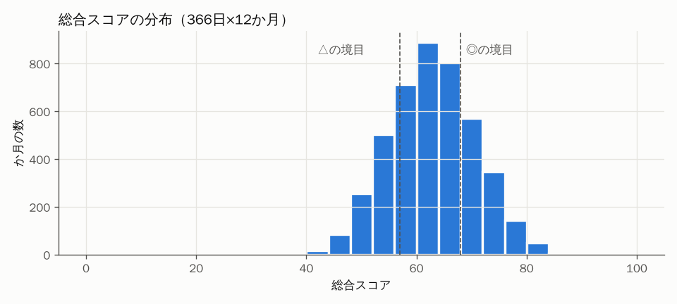
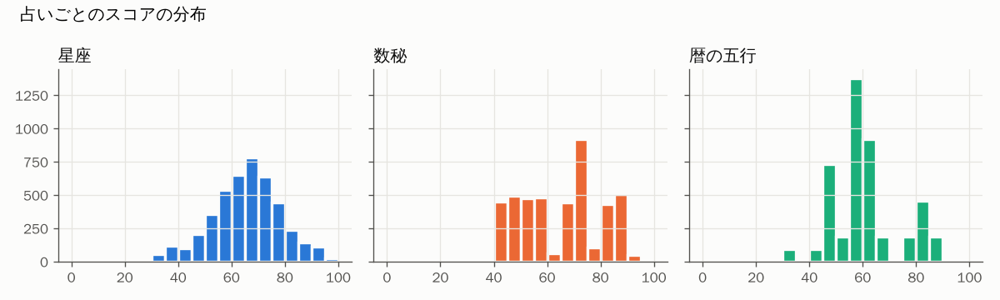
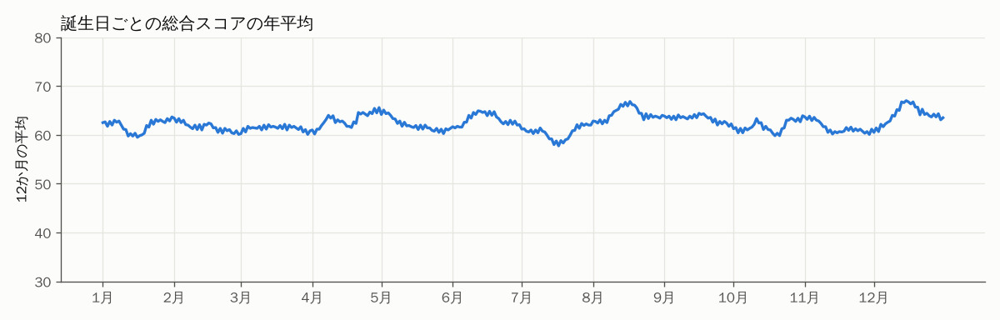
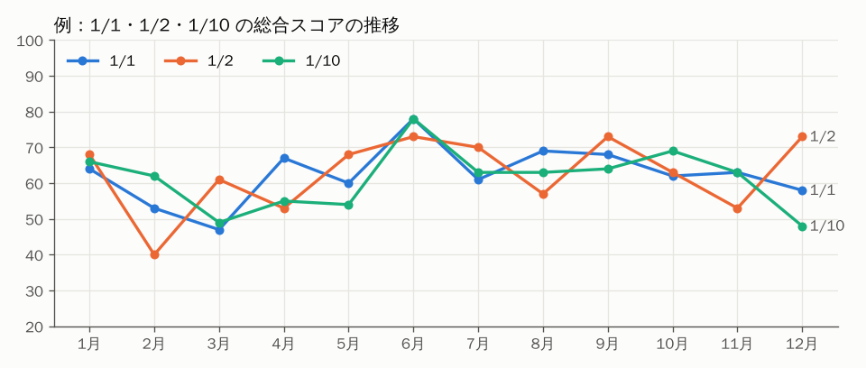

# フェーズ4 検査：月別スコア（scores_366.json）

`python work/scripts/build_scores.py && python work/scripts/check_scores.py` で再生成。計算規則は `work/knowledge/12_スコアと相性の規則.md`。**数字は手で直していない。**

## 全体
| 項目 | 星座 | 数秘 | 暦の五行 | 総合 |
|---|---|---|---|---|
| 平均 | 64.9 | 62.7 | 59.4 | 62.4 |
| ばらつき（標準偏差） | 12.9 | 14.9 | 12.3 | 7.7 |
| 最小 | 24.0 | 40.0 | 30.0 | 37.0 |
| 最大 | 99.0 | 90.0 | 85.0 | 86.0 |

- ◎の境目：総合 68 以上（全体の上位25%）／△の境目：57 未満（下位25%）
- 星座スコアの基準 S＝0.663（366日×12か月の値の大きさの99パーセンタイル）
- 2027年の月柱：1月辛丑・2月壬寅・3月癸卯・4月甲辰・5月乙巳・6月丙午・7月丁未・8月戊申・9月己酉・10月庚戌・11月辛亥・12月壬子

## 星座別の平均（総合）

| 星座 | 日数 | 総合の平均 | ページ平均の最小〜最大 | ◎の月の数（平均） | △の月の数（平均） |
|---|---|---|---|---|---|
| 山羊座 | 30 | 62.2 | 59.5〜65.2 | 3.3 | 2.8 |
| 水瓶座 | 30 | 62.4 | 61.0〜63.7 | 2.8 | 2.7 |
| 魚座 | 30 | 61.2 | 60.1〜62.2 | 2.4 | 3.0 |
| 牡羊座 | 31 | 61.9 | 60.1〜64.0 | 3.1 | 3.5 |
| 牡牛座 | 31 | 63.2 | 61.1〜65.6 | 3.7 | 2.6 |
| 双子座 | 31 | 62.7 | 60.2〜64.9 | 3.3 | 2.9 |
| 蟹座 | 31 | 60.6 | 57.8〜63.0 | 2.4 | 3.5 |
| 獅子座 | 32 | 63.7 | 60.8〜66.8 | 3.9 | 2.3 |
| 乙女座 | 31 | 63.7 | 62.6〜64.4 | 3.6 | 2.1 |
| 天秤座 | 30 | 61.5 | 59.8〜63.3 | 2.8 | 3.2 |
| 蠍座 | 30 | 62.1 | 60.2〜63.9 | 2.8 | 2.7 |
| 射手座 | 29 | 63.2 | 60.1〜67.0 | 3.6 | 2.6 |

## チェックリスト
| 検査 | 結果 |
|---|---|
| 1ページに◎が2つ以上 | ✅ 全ページ |
| 1ページに△が1つ以上 | ✅ 全ページ |
| 全部良い・全部悪いページがない | ✅ なし |
| 隣り合う日の12か月の推移が完全に同じ | ✅ なし |
| （参考）隣り合う日で◎○△の並びまで同じ | 1 組 |
| 総合が40を下回る月 | 1 か所（全4392か月中）。すべて計算どおり（手で作っていない） |
| 全体の基準だけでは◎2つ・△1つに届かず、「その人の上位2か月を◎・最下位を△」の規則で補ったページ | 33 ページ |

## いちばん良い月・いちばん慎重な月の分布（ページ数）

| 月 | 1月 | 2月 | 3月 | 4月 | 5月 | 6月 | 7月 | 8月 | 9月 | 10月 | 11月 | 12月 |
|---|---|---|---|---|---|---|---|---|---|---|---|---|
| 山の月 | 7 | 40 | 37 | 32 | 35 | 55 | 27 | 15 | 16 | 19 | 39 | 44 |
| 谷の月 | 30 | 18 | 39 | 49 | 18 | 10 | 21 | 30 | 51 | 23 | 26 | 51 |

## 分野別：山の月の分布（ページ数）

| 分野 | 1月 | 2月 | 3月 | 4月 | 5月 | 6月 | 7月 | 8月 | 9月 | 10月 | 11月 | 12月 |
|---|---|---|---|---|---|---|---|---|---|---|---|---|
| 仕事 | 37 | 40 | 28 | 39 | 25 | 28 | 34 | 26 | 47 | 19 | 24 | 19 |
| 恋愛 | 24 | 41 | 29 | 23 | 24 | 35 | 50 | 34 | 30 | 34 | 24 | 18 |
| 金運 | 36 | 16 | 27 | 37 | 11 | 32 | 35 | 37 | 40 | 41 | 23 | 31 |
| 健康 | 33 | 61 | 40 | 48 | 30 | 29 | 41 | 12 | 21 | 10 | 29 | 12 |
| 人間関係 | 23 | 21 | 31 | 36 | 22 | 28 | 31 | 38 | 37 | 40 | 28 | 31 |

## グラフ

